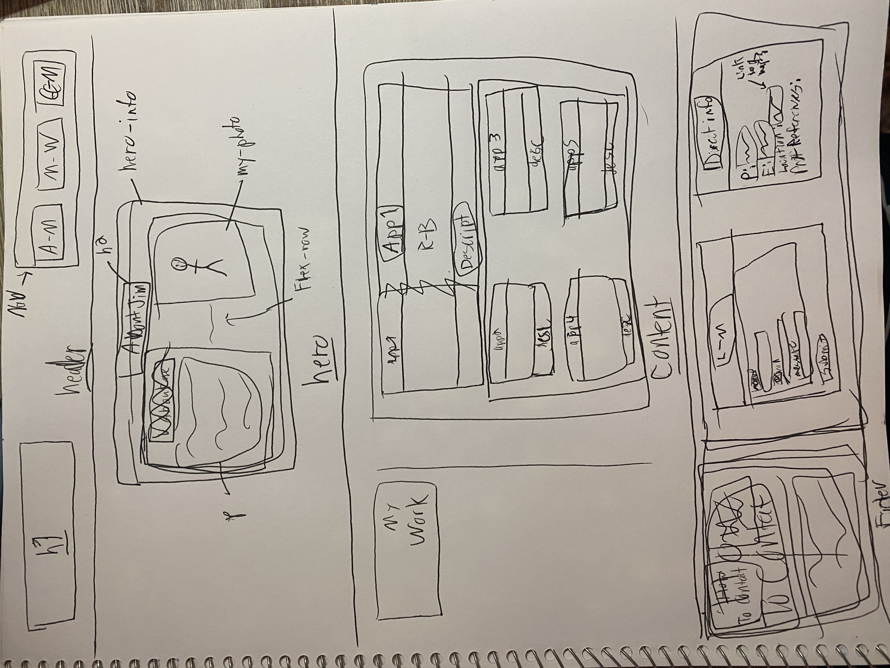

# JimK-WorkPortfolio
Ongoing portfolio of sample applications begun in Week 2.

### Initial rough outline sketch
After tinkering with the HTML structure, I decided to create a rough hand-drawn sketch of the basic outline.
This was used as a guideline as the HTML for the homepage was written.

## Sources

* [Source of Shortcut Icon](https://www.subpng.com/png-2nxt63/)
* [Source of Calculator Stock Image](https://www.vecteezy.com/photo/1986837-scientist-using-a-white-calculator)
* [Source of Surfing Stock Image](https://mocah.org/5339825-surfboard-gold-coast-australia-oceanwater-surfing-surfer-surf-ocean-swimming-nature-person-drone-aerial-beach-blue-hd-wallpaper-wallpaper-wafe-sufboard-free-stock-photos.html)